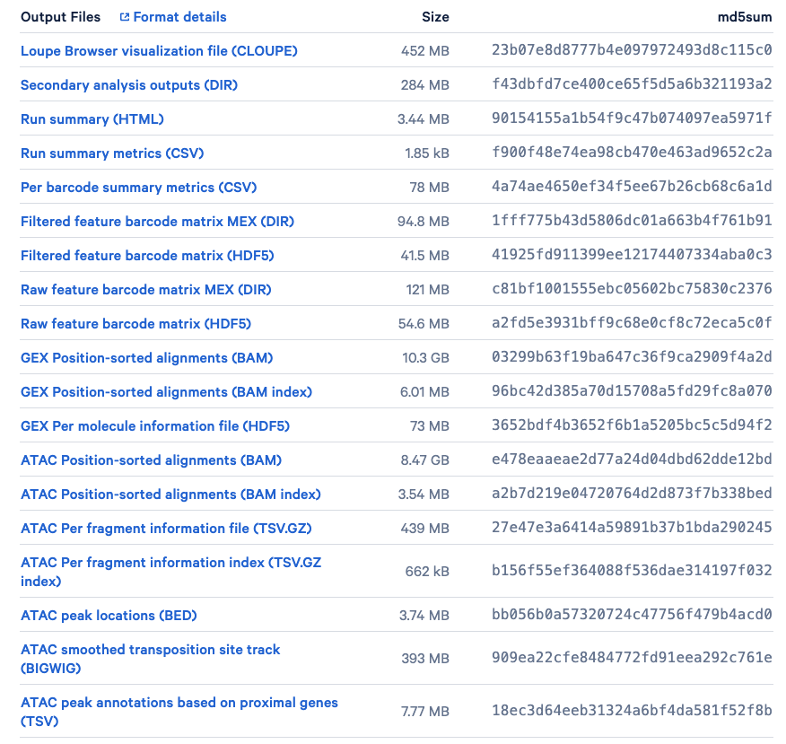

```{r, include = FALSE}
knitr::opts_chunk$set(
  collapse = TRUE,
  warning = FALSE,
  message = FALSE,
  comment = "#>",
  width = 60
)
set.seed(2024)
```

# Overview
Single-cell RNA sequencing is an effective method for analyzing the characteristics and dynamics in tissues in both healthy and diseased states. Nonetheless, to gain a comprehensive understanding of cellular conditions during illness or treatment, it can be beneficial to collect information beyond just the gene expression profile of a cell and turns to multimodal single-cell analysis. Single-cell multi-omics technologies concurrently combines different single-modality omics methods that profile the transcriptome, genome, epigenome, epitranscriptome, proteome, metabolome, and other (emerging) omics [@multiometech], which provides a comprehensive view and detailed characterization of individual cell states and activities. 

In our previous tutorial, we learned the workflow of multimodal single-cell omics analysis with the CITE-seq data, which combines scRNA-seq with antibody-derived tags to measure protein levels on the cell surface. In this tutorial, let's move to another commonly applied multiome data that is derived from simultaneous profiling of the transcriptome (scRNA-seq) and chromatin accessibility (scATAC-seq). 

 
## <span class="fa-stack fa"><i class="fa fa-circle fa-stack-2x"></i><i class="fa fa-pencil-alt fa-stack-1x fa-inverse"></i></span> Preparation and assumed knowledge
- Knowledge of R syntax [Basic tutorials of R](https://www.w3schools.com/r/default.asp)
- Basic knowledge in [single cell data analysis](https://bioconductor.org/books/release/OSCA/index.html) 
- Familiarity with the [Seurat class](https://satijalab.org/seurat/articles/get_started_v5_new) and [SingleCellExperiment class](https://bioconductor.org/packages/devel/bioc/vignettes/SingleCellExperiment/inst/doc/intro.html)

## <span class="fa-stack fa"><i class="fa fa-circle fa-stack-2x"></i><i class="fa fa-location-arrow fa-stack-1x fa-inverse"></i></span> Learning objectives

- Get familiar with the concepts of RNA + ATAC multiomic sequencing and analysis
- Understand the 10x multiome data
- Learn about the common practices of preprocessing the RNA + ATAC multiomic data, using the 10x multiome sample data
- Prepare the RNA + ATAC data for multiomic integrative analysis using Matilda
- Integrative analysis of the RNA + ATAC multiomic data using Matilda


<br><br>

## Schedule

Structure of this tutorial:

| Activity                                             | Time |
|------------------------------------------------------|------|
| 1 Overview                                           |  5m  |
| 2 Hello, 10x Multiome!                               | 15m  |
| 3 Preparation of required data files                 | 10m  |
| 4 Data preprocessing and analysis                    | 30m  |
| 5 Integrative analysis with Matilda                  | 60m  |


<br/>

# Hello, 10x Multiome!
The **10x Genomics' Single Cell Multiome ATAC + Gene Expression solution (10x Multiome)** is one of the dominant technology for combining the scRNA-seq and scATAC-seq. It integrates single-cell RNA sequencing (scRNA-seq) with a single-cell epigenetic readout in the form of chromatin accessibility profiling with single-cell ATAC-seq (scATAC-seq). With the joint profiling of RNA and ATAC, it connects information on the activity of regulatory elements to gene expression data in the same nucleus, which establishes a direct one-to-one connection between gene expression and epigenetic programs that are not capturable otherwise. 


Figure 1 provides an overview of the 10x Multiome workflow. In summary, Nuclei isolation is followed by "tagmentation" with Tn5 transposase, which fragments open chromatin and tags DNA with adapters for 10x Barcodes. The nuclei are then added to the 10x Chromium X, where specialized Next GEM beads capture adapters and mRNAs, adding cell- and molecule-specific barcodes. The mixture is then extracted, pooled, and undergoes library preparation, including amplification and cleanup, which can be then used for the next-generation sequencing. More details with step-by-step explanation can be found in the optional reading below.


```{r, echo=FALSE, out.width="98%", fig.align='center', fig.cap="Figure 1. 10x Multiome workflow. The paired ATAC and gene expression libraries are generatred from the isolated nuclei, which are then sequenced. (Source: 10x Genomics)"}
knitr::include_graphics("figures/workflow.png")
```


<details>
<summary>***(Optional Reading) How is the 10x multiome (RNA + ATAC) data profiled and prepared exactly?***</summary>
<br/>
Specifically, the 10x Multiome combines the pre-existing scRNA-seq with a scATAC-seq technology, namely 10x Genomics' (3') Chromium Single Cell Gene Expression ([Click to see the workflow](https://www.scdiscoveries.com/blog/knowledge/single-cell-transcriptomics/#how-it-works)), and Chromium Single Cell ATAC ([Click to see the workflow](https://www.scdiscoveries.com/blog/knowledge/how-scatac-seq-works/#the-method)). According to the [user guide for the 10x Multiome](https://assets.ctfassets.net/an68im79xiti/7x5E4P6xefQruTbFg0yr3a/1381fdcd2d2e7d667ef5b415119dab15/CG000338_ChromiumNextGEM_Multiome_ATAC_GEX_User_Guide_RevE.pdf#page=32.10), it mainly consists of the following 8 steps to acquire the scRNA+scATAC data:


**Step 1. Transposition**
Nuclei suspensions are incubated in a Transposition Mix that includes a Transposase. The Transposase enters the nuclei and preferentially fragments the DNA in open regions of the chromatin. Simultaneously, adapter sequences are added to the ends of the DNA fragments.


**Step 2. GEM Generation & Barcoding**
Similar to the aforementioned 10x Genomics' (3') Chromium Single Cell Gene Expression and Chromium Single Cell ATAC workflows, 10x Multiome also relies on the next GEMs (Gel bead-in-EMulsion) in the Chromium X. As is shown in the Figure 2 below, in the 10x Multiome protocol, the Gel bead include (1) a poly(dT) sequence that enables production of barcoded, full-length cDNA from poly-adenylated mRNA for gene expression (GEX) library, and (2) a Spacer sequence that enables barcode attachment to transposed DNA fragments for ATAC library. 

```{r, echo=FALSE, out.width="70%", fig.align='center', fig.cap="Figure 2. Two types of oligos line a 10x Multiome bead. One contains a poly(dT)VN to bind Poly(A) tails of mRNA transcripts, another a spacer that binds the Tn5-adapted DNA fragments of the scATAC library. (Source: 10x Genomics)"}
knitr::include_graphics("figures/10x_gem_multi.png")

```

GEMs are generated by combining barcoded Gel Beads, transposed nuclei, a Master Mix, and Partitioning Oil on a Chromium Next GEM Chip J (See Figure 3 below). 

```{r, echo=FALSE, out.width="50%", fig.align='center', fig.cap="Figure 3. GEM generation protocol. To achieve single nuclei resolution, the nuclei are delivered at a limiting dilution, such that the majority (~90-99%) of generated GEMs contains no nuclei, while the remainder largely contain a single nucleus. (Source: 10x Genomics)"}
knitr::include_graphics("figures/gem.png")

```

Upon GEM generation, the Gel Bead dissolves, releasing oligonucleotides containing an Illumina® P5 sequence, a 16 nt 10x Barcode (for ATAC), and a Spacer sequence. In the same partition, primers with an Illumina® TruSeq Read 1, a 16 nt 10x Barcode (for GEX), a 12 nt unique molecular identifier (UMI), and a 30 nt poly(dT) sequence are also released. These primers mix with the nuclei lysate containing transposed DNA fragments, mRNA, and Master Mix, which includes reverse transcription (RT) reagents.

Incubation of the GEMs, as is shown in Figure 4 below, produces 10x Barcoded DNA from the transposed DNA (for ATAC) and 10x Barcoded, full-length cDNA from poly-adenylated mRNA (for GEX). This is followed by a quenching step that stops the reaction.

```{r, echo=FALSE, out.width="90%", fig.align='center', fig.cap="Figure 4. What is happening during the incubation inside individual GEMs. (Source: 10x Genomics)"}
knitr::include_graphics("figures/insidegem.png")

```


**Step 3. Post-GEM Cleanup**
After the GEMs incubation, the GEMs are broken and pooled fractions are recovered. Silane magnetic beads are used to purify the cell barcoded products from the post GEM-RT reaction mixture, which includes leftover biochemical reagents and primers.

**Step 4. Pre-Amplification PCR**
Barcoded transposed DNA and barcoded full length cDNA from poly-adenylated mRNA are amplified via PCR to fill gaps and for generating sufficient mass for library construction (See Figure 5). The pre-amplified product is used as input for both ATAC library construction and cDNA amplification for gene expression library construction.

```{r, echo=FALSE, out.width="70%", fig.align='center', fig.cap="Figure 5. Pooled pre-amplification PCR. (Source: 10x Genomics)"}
knitr::include_graphics("figures/amplification.png")

```

**Step 5. ATAC Library Construction**
P7 and a sample index are added to pre-amplified transposed DNA during ATAC library construction via PCR. The final ATAC libraries contain the P5 and P7 sequences used in Illumina® bridge amplification (See Figure 6).

```{r, echo=FALSE, out.width="50%", fig.align='center', fig.cap="Figure 6. ATAC library construction. (Source: 10x Genomics)"}
knitr::include_graphics("figures/ataclib.png")

```

**Step 6. GEM cDNA Aplification**
Barcoded, full-length pre-amplified cDNA is amplified via PCR to generate sufficient mass for gene expression library construction.

**Step 7. Gene Expression Library Construction**
Enzymatic fragmentation and size selection are used to optimize the cDNA amplicon size. P5, P7, i7 and i5 sample indexes, and TruSeq Read 2 (read 2 primer sequence) are added via End Repair, A-tailing, Adaptor Ligation, and PCR. The final gene expression libraries contain the P5 and P7 primers used in Illumina® bridge amplification (See Figure 7).

```{r, echo=FALSE, out.width="50%", fig.align='center', fig.cap="Figure 7. cDNA amplification & gene expression library construction. (Source: 10x Genomics)"}
knitr::include_graphics("figures/rnalib.png")

```

**Step 8. Sequencing**
As is demonstrated in Figure 8, Chromium Single Cell Multiome ATAC libraries comprise double stranded DNA with standard Illumina® paired-end constructs which begin with P5 and end with P7. Sequencing these libraries produces a standard Illumina® BCL data output folder that includes paired-end Read 1N and Read 2N used for sequencing the DNA insert, along with the 8 bp sample index in the i7 read and 16 bp 10x Barcode sequence in the i5 read
.

```{r, echo=FALSE, out.width="70%", fig.align='center', fig.cap="Figure 8. Chromium Single Cell Multiome ATAC library.  (Source: 10x Genomics)"}
knitr::include_graphics("figures/seq1.png")

```

As is illustrated in Figure 9, Chromium Single Cell Multiome Gene Expression libraries comprise cDNA insert with standard Illumina® paired-end constructs which begin with P5 and end with P7. Sequencing these libraries produces a standard Illumina® BCL data output folder. TruSeq Read 1 is used to sequence 16 bp 10x Barcodes and 12 bp UMI, while 10 bp i5 and i7 sample index sequences are the sample index reads. TruSeq Read 2 is used to sequence the insert.

```{r, echo=FALSE, out.width="70%", fig.align='center', fig.cap="Figure 9. Chromium Single Cell Multiome Gene Expression library. (Source: 10x Genomics)"}
knitr::include_graphics("figures/seq2.png")

```

</details>

<br/><br/>
After sequencing, the sequencer outputs are processed and pre-analyzed by the [Cell Ranger ARC pipelines](https://support.10xgenomics.com/single-cell-multiome-atac-gex/software/pipelines/latest/what-is-cell-ranger-arc) from 10x Genomics. In the following sections, we will learn how to load the RNA and ATAC data from the serious output files from Cell Ranger. 

# Preparation of required data files
In this section, we first prepare our sample 10x multiome data. We will use the PBMC multiome dataset publicly available from [10x genomics](https://www.10xgenomics.com/datasets/pbmc-from-a-healthy-donor-granulocytes-removed-through-cell-sorting-3-k-1-standard-1-0-0). This PBMCs is from a healthy female donor aged 25 and were obtained by 10x Genomics from AllCells. In this dataset, scRNA-seq and scATAC-seq profiles were simultaneously collected in the same cells. From the [dataset introduction site](https://www.10xgenomics.com/datasets/pbmc-from-a-healthy-donor-granulocytes-removed-through-cell-sorting-3-k-1-standard-1-0-0), we can see that a series of output files from the Cell Ranger are available (See Figure 10 below). A detailed introduction for each of the file can be found from the [Cell Ranger guide](https://support.10xgenomics.com/single-cell-multiome-atac-gex/software/pipelines/latest/output/overview). 

```{r, echo=FALSE, out.width="70%", fig.align='center', fig.cap="Figure 10. Output files of our sample data available for download. (Source: 10x Genomics)"}


```


Here, our goal is to derive the RNA and ATAC matrix. We will only focus on the following three files:

- `pbmc_granulocyte_sorted_3k_filtered_feature_bc_matrix.h5`: The filtered feature barcode matrix (HDF5). The rows represent features, genes and peaks detected, while the columns consist of all cell-associated barcodes.

- `pbmc_granulocyte_sorted_3k_atac_fragments.tsv.gz`: The ATAC Per fragment information file (TSV.GZ). It contains one line per unique fragment with tab-separated fields, including the reference genome chromosome of fragment (`chrom`), the adjusted start and end position of fragment on chromosome (`chromStart`, `chromEnd`), the 10x barcode of the fragment (`barcode`), and the total number of read pairs associated with this fragment (`readSupport`). 

- `pbmc_granulocyte_sorted_3k_atac_fragments.tsv.gz.tbi`: The ATAC Per fragment information index (TSV.GZ index). It is a [tabix](http://www.htslib.org/doc/tabix.html) index of the fragment intervals facilitating random access to records from an arbitrary genomic interval. 


To facilitate easy loading and exploration, we pre-downloaded the three files already. You can find them in the `data` folder. However, you can also download these required data by yourself later via running the following lines in a shell.

<details>
<summary>***(Optional) Downloading the data yourself***</summary>
```{bash, echo=TRUE, eval=FALSE, class.source = "fold-show"}
wget https://cf.10xgenomics.com/samples/cell-arc/1.0.0/pbmc_granulocyte_sorted_3k/pbmc_granulocyte_sorted_3k_filtered_feature_bc_matrix.h5
wget https://cf.10xgenomics.com/samples/cell-arc/1.0.0/pbmc_granulocyte_sorted_3k/pbmc_granulocyte_sorted_3k_atac_fragments.tsv.gz
wget https://cf.10xgenomics.com/samples/cell-arc/1.0.0/pbmc_granulocyte_sorted_3k/pbmc_granulocyte_sorted_3k_atac_fragments.tsv.gz.tbi
```

</details>


# Data preprocessing and analysis
Now we have data files ready! In the following sections, we will prepare the matrix data in R and conduct some essential data preprocessing and analysis. We will mostly follow the common practice of joint RNA and ATAC analysis introduced by [Signac](https://stuartlab.org/signac/articles/pbmc_multiomic). 

## Load libraries
Before getting start, let us load some of the R libraries we will use. 
```{r message = FALSE}
library(ggplot2)
library(Signac)
library(Seurat)
library(EnsDb.Hsapiens.v86) # get gene annotations for hg19 for creating the ATAC assay
library(SeuratDisk) # for load the annotated pbmc reference dataset
library(BSgenome.Hsapiens.UCSC.hg38)
```


## Data preparation
With the three required files, we can easily create a Seurat object based on the gene expression data, and then add in the ATAC-seq data as a second assay. First, let us load the read count matrix from 10X CellRanger hdf5 file into R, using the `Read10x_H5` function from `Seurat`. This will give us the access to both RNA data (`Gene Expression`) and ATAC data matrix (`Peaks`).


```{r}

# This will give us both the RNA and ATAC matrix data, named as 'Gene Expression' and 'Peaks' respectively.
counts <- Read10X_h5("../data/pbmc_granulocyte_sorted_3k_filtered_feature_bc_matrix.h5")
```


<br/>
Now, we can create a `Seurat` object named `pbmc` and initialize it with the RNA data matrix.
```{r}
# create a Seurat object containing the Gene Expression matrix
pbmc <- CreateSeuratObject(
  counts = counts$`Gene Expression`,
  assay = "RNA"
)
```


<br/>
We are already familiar with the RNA cell by feature matrix (`Gene Expression`). Let's have a look at how the ATAC data matrix (`Peaks`) looks like. As can be seen in the first 10 rows by first 10 columns of the `Peaks` matrix below, it is a sparse matrix with non-zero values stored only. It looks much like the scRNA-seq cell by feature count matrix. The major difference is the features (row names) are not genes but the regions of the peaks that are predicted to be open chromatin by the peak callers. The non-zero values stored in matrix represents the number of tn5 integration site in each of the cell (column) that maps to each region (row). 

```{r}
counts$Peaks[1:10,1:10]
```


<br/>
For creating the chromatin assay object, we also need information from the other two files: the ATAC Per fragment information file and the ATAC Per fragment information index. We will store the created ATAC assay in the `pbmc` object as a secondary assay. Note that in the following code, we also add gene annotations to the ATAC assay object for the human genome. This allows downstream functions to pull the gene annotation information directly from the object.

<details>
<summary>***What does the fragment file look like?***</summary>
<br/>
As is introduced above, the ATAC Per fragment information file (TSV.GZ) contains one line per unique fragment with tab-separated fields, including the reference genome chromosome of fragment (`chrom`), the adjusted start and end position of fragment on chromosome (`chromStart`, `chromEnd`), the 10x barcode of the fragment (`barcode`), and the total number of read pairs associated with this fragment (`readSupport`). Let's read the fragment file and see what do these values actually look like:

```{r}
# read file (only read 10 rows)
fragpath <- "../data/pbmc_granulocyte_sorted_3k_atac_fragments.tsv.gz"
frag.file <- read.delim(fragpath, header=F, nrows = 10)
# change the column names 
colnames(frag.file) <- c('chrom','chromStart','chromEnd','barcode','readSupport')
# preview of the file content
head(frag.file)
```

</details>

```{r, warning=FALSE}
# specifying the path to the fragment information file
fragpath <- "../data/pbmc_granulocyte_sorted_3k_atac_fragments.tsv.gz"

# convert EnsDb (Ensembl database) to GRanges object 
annotation <- GetGRangesFromEnsDb(ensdb = EnsDb.Hsapiens.v86)
# convert to UCSC style by adding the 'chr' prefix
seqlevels(annotation) <- paste0('chr', seqlevels(annotation))

# create ATAC assay from the 'Peaks' matrix and add it to the object, together with the gene annotation
pbmc[["ATAC"]] <- CreateChromatinAssay(
  counts = counts$Peaks,
  sep = c(":", "-"),
  fragments = fragpath,
  annotation = annotation # store the gene annotation information
)
```

<br/>
<details>
<summary>***What does the annotation look like?***</summary>
<br/>
As can be seen from the output below, the `annotation` object extracts the Exon and the coding region information from the transcripts across the genes across all the chromosomes along with the strand and the genomic location. 

```{r}
annotation
```

</details>


Specifically, the `ChromatinAssay` used above for storing the ATAC data enables some specialized functions for analysing genomic single-cell assays such as scATAC-seq. By printing the assay we can see some of the additional information that can be contained in the `ChromatinAssay`, including motif information, gene annotations, and genome information. The detailed instruction on how to access these information stored in a `ChromatinAassay` object can be found from [Signac](https://stuartlab.org/signac/articles/data_structures#the-chromatinassay-class).

```{r}
pbmc[["ATAC"]]
```

## Quality control
As is done in our previous tutorials for scRNA-seq, we need to perform the quality control by assessing the quality of the data and filtering the poor quality cells. Here, we will compute and look at the per-cell quality control metrics using the DNA accessibility data and remove cells that are outliers for these metrics, as well as cells with low or unusually high counts for either the RNA or ATAC assay. The [NucleosomeSignal](https://stuartlab.org/signac/reference/nucleosomesignal) function below calculates the strength of the nucleosome signal per cell. It computes the ratio of fragments between 147 bp and 294 bp (mononucleosome) to fragments < 147 bp (nucleosome-free). The [TSSEnrichment](https://stuartlab.org/signac/reference/tssenrichment) function computes the transcription start site (TSS) enrichment score for each cell. 


<br/>
<details>
<summary>***Question: What are the nucleosome signal and transcription start site (TSS) enrichment score? How to utilize it to control the quality of the DNA accessibility data? ***</summary>

</br>
***Nucleosome signal*** calculates the ratio of mononucleosome (fragments with length between 147 bp and 294 bp) to nucleosome-free regions (fragments with length less than 147 bp) by looking at the distribution of DNA fragment lengths from the cell. Considering the aim of scATAC-seq, we essentially want to retain only those fragments that are not bound by the mononucleosomes, which are free of nucleosomes and open and accessible for the other DNA binding proteins to bind to these DNA. Thus, cells with lower nucleosome signal indicates that it has enrichment of fragments that are not bound by nucleosomes. 

***Transcription start site (TSS) enrichment score*** The transcription start site (TSS) enrichment score was originally defined by the ENCODE consortium [@encode] as a signal-to-noise metric for ATAC-seq experiments. The idea is that if these fragments are from open chromatin region that is not bound by any nucleosome, the genes in this region will be actively transcribed or regulated. Therefore, these nucleosome-free regions should be expected to be enriched around the transcription start site of these genes. The enrichment score is calculated by taking a ratio of the fragments centered at the transcription start site over the fragments in the TSS flanking regions that is around the TSS regions. With regards to the scATAC-seq, we ideally want to retain those cells that have a high transcription start site enrichment score. 

We can see from the above that the nucleosome signal and transcription start site enrichment score are two complementary metrics for measuring the amount of potential nucleosome-free fragments contained by the cells in the scATAC-seq data. 

</details>

```{r}
DefaultAssay(pbmc) <- "ATAC"

# Calculate the strength of the nucleosome signal per cell
pbmc <- NucleosomeSignal(pbmc)
pbmc <- TSSEnrichment(pbmc)
# We can see where these calculated results are stored in our meta.data
colnames(pbmc@meta.data)[1:10]
```


<br/>
The relationship between variables stored in the object metadata can be visualized using the [DensityScatter](https://stuartlab.org/signac/reference/densityscatter) function from Signac. This can also be used to quickly find suitable cutoff values for different QC metrics by setting `quantiles=TRUE`:

```{r}
DensityScatter(pbmc, x = 'nCount_ATAC', y = 'TSS.enrichment', log_x = TRUE, quantiles = TRUE)
```

<br/>
For the scatter plot generated above, the x-axis represents the number of counts whereas the y-axis is the TSS enrichment score. Each cell is colored by the density of points. We can see there are some red lines going across the plots both vertically and horizontally. The vertical red lines are the 5th quantile, 10th quantile, 90th quantile and 95th quantile of the `nCount` while their corresponding values can be found at the top of the plot. Similarly, the horizontal red lines are the quantiles for the TSS enrichment score. By visualizing data in this way, it helps us come up with filtering thresholds to ensure that we are not choosing a threshold that is too stringent that majority of our cells are filtered out and at the same time selecting a threshold that retains high quality of cells. 


Similarly, we can create the scatter plot with the nucleosome signal as well.

```{r}
DensityScatter(pbmc, x = 'nCount_ATAC', y = 'nucleosome_signal', log_x = TRUE, quantiles = TRUE)
```


<br/>
Also, we can plot the distribution of each QC metric in violin plot using the [VlnPlot](https://satijalab.org/seurat/reference/vlnplot) function from Seurat. We can simply choosing which features (metrics) to be plotted by changing the input to the `features` parameter. In the example below, we will plot the distribution of RNA read counts (`nCount_RNA`), the ATAC peak counts (`nCount_ATAC`), the TSS enrichment score (`TSS.enrichment`) and the nucleosome signal (`nucleosome_signal`). This can be another visualization for helping us deciding the proper thresholds. 

```{r}

VlnPlot(
  object = pbmc,
  features = c("nCount_RNA", "nCount_ATAC", "TSS.enrichment", "nucleosome_signal"),
  ncol = 4,
  pt.size = 0
)

```


<br/>
Now, based on our QC above, we can decide the thresholds for filtering the low quality cells. Here, we will keep cells with number of ATAC peak counts between 500 and 100k, number of RNA read counts between 500 and 12k, the strength of the nucleosome signal smaller than 1.5, and the TTS enrichment score greater than 1. 

```{r}
# filter out low quality cells
pbmc <- subset(
  x = pbmc,
  subset = nCount_ATAC < 50000 &
    nCount_RNA < 12000 &
    nCount_ATAC > 500 &
    nCount_RNA > 500 &
    nucleosome_signal < 1.5 &
    TSS.enrichment > 1
)
pbmc
```


<br/>
<details>
<summary>***Question: How will you decide the thresholds for cut-offs?***</summary>
<br/>
It is important to keep in mind, as with scRNA-seq we introduced in our previous tutorial (Introduction to Single-cell), all these cut-offs vary depending on your biological system, cell viability, and other factors. In some cases, you may want to set lower or more stringent thresholds to avoid removing rare cell populations or to capture cell types which may have specific characteristics. 

In our previous tutorial (Introduction to Single-cell), we have walked through the detailed QC procedure for scRNA-seq data. *Can you still recall what they are?* In the current tutorial section, we introduced another two scATAC-seq based QC metrics, which can help us filtering the low quality cells from the perspective of the DNA accessibility data. More scATAC-seq QC metrics can be found from the Computing QC Metrics section in [Signac](https://stuartlab.org/signac/articles/pbmc_vignette.html#computing-qc-metrics).
</details>


## Gene expression data processing
In our previous tutorial (Basics of Single-celll Annotation, Section 4), we've learned to preprocess the scRNA-seq data before dimension reduction, using the `NormalizeData`, `FindVariableFeatures` and `ScaleData` functions from Seurat. More recently, Seurat proposes another normalization and variance stabilization algorithm for preprocessing scRNA-seq data, namely [SCTransform](https://satijalab.org/seurat/reference/sctransform), which is recommended by Seurat to be used as the alternative to the `NormalizeData`, `FindVariableFeatures`, `ScaleData` workflow. Let's try to use `SCTransform` here. The results of `SCTransform` are saved in a new assay (named `SCT` by default) with `scale.data` being pearson residuals, which are claimed to be independent of sequencing depth and can be used for different processing and downstream analysis such as variable gene selection, dimensional reduction, clustering, visualization, and differential expression. More details can be found in their [manuscript](https://genomebiology.biomedcentral.com/articles/10.1186/s13059-019-1874-1).


```{r, results='hide'}
DefaultAssay(pbmc) <- "RNA"
# Let's try SCTransform as an alternative to the NormalizeData, FindVariableFeatures, ScaleData workflow
pbmc <- SCTransform(pbmc)
# After that, we can run the PCA as we did before
pbmc <- RunPCA(pbmc)
```


## DNA accessibility data processing
Now, we will process the DNA accessibility assay using a similar workflow from Signac. We first apply the frequency-inverse document frequency (TF-IDF) normalization ([RunTFIDF](https://stuartlab.org/signac/reference/runtfidf) function), which is a two-step normalization procedure that both normalizes across cells to correct for differences in cellular sequencing depth, and across peaks to give higher values to more rare peaks. Then we find the set of variable features ([FindTopFeatures](https://stuartlab.org/signac/reference/findtopfeatures) function) and conduct the singular value decomposition (SVD) for dimension reduction ([RunSVD](https://stuartlab.org/signac/reference/runsvd) function). The resulted dimension reduction object will be stored as `lsi`. To put it simple, you can think of this as analogous to the output of PCA in the scRNA-seq case.


```{r, results='hide'}
DefaultAssay(pbmc) <- "ATAC"
pbmc <- RunTFIDF(pbmc) # TF-IDF normalization
pbmc <- FindTopFeatures(pbmc, min.cutoff = 5) # selecting the top features (with the minimum number of counts for the feature to be included set to be 5)
pbmc <- RunSVD(pbmc) # dimension reduction

# RunTFIDF + RunSVD above performs the Latent Semantic Indexing (LSI), which is a dimension reduction method that uses term frequency inverse document frequency transformation (TFIDF) followed by singular value decomposition (SVD).
```


## Cell type annotation
Try to recall that we have used the scClassify package to annotate scRNA-seq datasets in our previous tutorial (Basics of Single-cell Annotation). It is also possible to annotate our RNA+ATAC multiomic dataset with scClassify, utilizing a reference scRNA-seq data with cell type annotation, solely based on the transcriptome. More specifically, we can train our scClassify model with our annotated reference scRNA-seq data and predict the cell types of our `pbmc` dataset. This is useful especially when we want to annotate our multiomic dataset but only have a scRNA-seq atlas available at hand. 

To do this, we will introduce another PBMC dataset generated from [10x Genomics](https://support.10xgenomics.com/single-cell-multiome-atac-gex/datasets/1.0.0/pbmc_granulocyte_sorted_10k). Like our `pbmc` dataset, it is also a paired multiomic data with scRNA-seq + scATAC-seq available. We annotated this dataset based on the clusters, following the [Seurat Vignettes](https://satijalab.org/seurat/articles/weighted_nearest_neighbor_analysis#wnn-analysis-of-10x-multiome-rna-atac). We can load the annotated reference data directly from the `pbmc10k.rds` file as a Seurat object. We can see that this reference data has been already normalized using the [SCTransform](https://satijalab.org/seurat/reference/sctransform). 

```{r}
# load PBMC reference
reference <- readRDS('../data/pbmc10k.rds')
reference
```

We can access the annotation via `reference$celltype`. From the bar plot below, we can see that it has 19 cell types.
```{r}
ggplot(reference@meta.data, aes(x=celltype, fill=celltype))+geom_bar()
```

Now, let's utilize the scRNA-seq from this reference pbmc dataset and annotate our `pbmc` dataset using scClassify. 

```{r}
library(scClassify)
# Train on reference pbmc dataset
train_scClassify <- scClassify::train_scClassify(exprsMat_train = reference@assays$SCT$scale.data, 
                                           cellTypes_train = reference$celltype,
                                           algorithm = "WKNN",
                                           selectFeatures = c("limma"),
                                           similarity = c("pearson"),
                                           returnList = FALSE,
                                           verbose = TRUE)
```
After the training is finished, we can visualise the cell type hierarchy tree.
```{r}
scClassify::plotCellTypeTree(train_scClassify@cellTypeTree, group_level = 3)
```

Then, we can predict the cell types of our `pbmc` dataset using the trained scClassify model.
```{r}
pred_res <- scClassify::predict_scClassify(exprsMat_test = pbmc@assays$SCT$scale.data,
                               trainRes = train_scClassify,
                               algorithm = "WKNN",
                               features = c("limma"),
                               similarity = c("pearson"),
                               prob_threshold = 0.7,
                               verbose = TRUE)
```

Let's look into the predicted cell types. We will save this annotation into the `pbmc` object as `annotation_scclassify`.
```{r}
n <- ncol(pred_res$pearson_WKNN_limma$predLabelMat)
annotation_scclassify <- pred_res$pearson_WKNN_limma$predLabelMat[,n]
pbmc$annotation_scclassify <- annotation_scclassify
ggplot(data.frame(celltype=annotation_scclassify), aes(x=celltype, fill=celltype))+geom_bar()
```


Now, similar to what we've done with the scRNA-seq in our previous tutorials, let's try to run UMAP and visualize it with the cell type annotation we just derived. Since we have two modalities, we can run UMAP with both modalities.

```{r}

DefaultAssay(pbmc) <- "RNA"
pbmc <- RunUMAP(pbmc, reduction = "pca", dims = 1:30, reduction.name = "umap.rna", reduction.key = "rnaUMAP_")
p1 <- DimPlot(pbmc, reduction='umap.rna', group.by = "annotation_scclassify", label = TRUE) + NoLegend() + ggtitle("RNA")

DefaultAssay(pbmc) <- "ATAC"
pbmc <- RunUMAP(pbmc, reduction = "lsi", dims = 2:30, reduction.name = "umap.atac", reduction.key = "atacUMAP_")
p2 <- DimPlot(pbmc, reduction='umap.atac', group.by = "annotation_scclassify", label = TRUE) + NoLegend() + ggtitle("ATAC")                  

p1+p2
```

<br/>

## Linking peaks to genes

For each gene, we can find the set of peaks that may regulate the gene by by computing the correlation between gene expression and accessibility at nearby peaks, and correcting for bias due to GC content, overall accessibility, and peak size. See the [Signac paper](https://www.biorxiv.org/content/10.1101/2020.11.09.373613v1) for a full description of the method we use to link peaks to genes.

Running this step on the whole genome can be time consuming, so here we demonstrate peak-gene links for a subset of genes as an example. The same function can be used to find links for all genes by omitting the `genes.use` parameter:

```{r, warning=FALSE}
DefaultAssay(pbmc) <- "ATAC"
Idents(pbmc) <- pbmc$annotation_scclassify
# first compute the GC content for each peak
pbmc <- RegionStats(pbmc, genome = BSgenome.Hsapiens.UCSC.hg38)

# link peaks to genes
pbmc <- LinkPeaks(
  object = pbmc,
  peak.assay = "ATAC",
  expression.assay = "SCT",
  genes.use = c("LYZ", "MS4A1")
)

```


We can visualize these links using the `CoveragePlot()` function, or alternatively we could use the `CoverageBrowser()` function in an interactive analysis:
```{r}
idents.plot <- c("Naive B", "Intermediate B", "Memory B",
                 "CD14 Mono", "CD16 Mono", "CD8 TEM_1", "CD8 TEM_2", "CD8 Naive")

p1 <- CoveragePlot(
  object = pbmc,
  region = "MS4A1",
  features = "MS4A1",
  expression.assay = "SCT",
  idents = idents.plot,
  extend.upstream = 500,
  extend.downstream = 10000
)

p2 <- CoveragePlot(
  object = pbmc,
  region = "LYZ",
  features = "LYZ",
  expression.assay = "SCT",
  idents = idents.plot,
  extend.upstream = 8000,
  extend.downstream = 5000
)

patchwork::wrap_plots(p1, p2, ncol = 1)
```


```{r, eval=FALSE}
# Save the pbmc data
saveRDS(pbmc, '../data/pbmc3k.rds')
```


# Integrative analysis of single-cell multiomic data with Matilda 
While methods designed for analysing scRNA-seq data or scATAC-seq data alone can be also applied to analyse RNA modality or ATAC modality in multimodal single-cell omics data, most of them cannot take advantage of other available data modalities and therefore could not fully utilize the information embedded in such data. This motivates the methods for integrative analysis on multiomic data, which make the best use of all these information across different modalities together in the downstream tasks.

In this section, we will introduce a deep learning-based model called  [Matilda](https://watermark.silverchair.com/gkad157.pdf?token=AQECAHi208BE49Ooan9kkhW_Ercy7Dm3ZL_9Cf3qfKAc485ysgAAA0kwggNFBgkqhkiG9w0BBwagggM2MIIDMgIBADCCAysGCSqGSIb3DQEHATAeBglghkgBZQMEAS4wEQQMik7uvO7FTqABDeMQAgEQgIIC_CftO2hSzWxw6Vf7JkEAcSpYQwtOkIPxAQHA2nbU8zHvSzj8xsjbiOZuLg6psUgq6UCpDESP0zBy2XKBanSFg-kNVxuhpSkrbCVi2A7ncr3JGYxsoW_6ZJWQ-A7fcQ6zO4qgaUXeVgaSsY3bKDXbxqGc8_BnJgLac9Em9ysK9OizwjCI-K5irmBaisiyZJyLzdyTyfO9vv6YRPhybL29fCknvngzDPYek-tvj5X0URGQqqFFZPz5SQAyFjEt_fleCxOVBSR30kW7QbE4cv5pniI2iu8znCNUwo4jL-axYShy81amjf8TbjkrMQGDdtPH0z2NxmON39Vbhd-UjojNqCL77ZJf6k7LBgGvyRRBpkUfWOkpNTsnbtrFrpZ5aCFoNmaeoqesAlF15O-NSd-6rZhHANbx8-WFmusghj2FZrQdn_cCjt8qeGlwpx9VkV6gxelL3Mt4ftBCkAReq6aMVxJf1LypfcjO-QSoTJpe44bUC-bRV95vg7jToFLZR52K8a-JD8fZXtpDvn6mgN7nbzuD3gaqjgsWMlTUbXpVUpSUUz84LZx2FhXOFPUkNxXFjl0q9S9u9AlFSY1Mfwc46DlPwgYeRqi-7heHnA0iPMKIs_io4lOU9pcObDBixxSzk5OKaJh3GL0IWC0rzBNDrqMuILO5tAUCw2prUFZtXouc8hc_9mXZ906hi2BfMrAflzHxnaP2n-zA6RB1tfVJ2ZdnbR0Hzup4Hj6BHaOmZ8s9NqjbK6HsIjJ28PAJ16QNcT6-nCGbOULGFv1pWKYlWIMJORWDnzpV9-FGQtKeSyXvbjPwp1-5ELckUIgMy3Idkqc0KSQIZS789_rWvh-U0YPINFnxfY9AdWerbOaIHDXxMLjr88tMUHug0RmBT5GsrNYzy5rqqFJjXxIheCaNIqlNoywO5nTxWS2X9HQX_IeJC6LgD3q9uR_kFtiFCnQ-fvLSaO_HzQFpzZID3sDdFaYheTtU3RBCaCwZ1WxvM24L3Rlqj_TUzjh9qJRY), which proposes a multitask learning method for integrative analysis of multimodal single-cell omics data. It can be applied to integratively analyse different combination of modalities such as RNA+ADT, RNA+ATAC and RNA+ADT+ATAC etc. Thus, we can easily utilise it to analyse our 10x multiome data with RNA+ATAC. 

More specifically, we will use our reference RNA+ATAC data introduced above as training and evaluation set while using our `pbmc` dataset as test set to run Matilda. By doing this, we can utilise the annotation from the reference dataset to annotate our `pbmc` dataset, via looking at both modalities together, which is different to our scClassify annotation in the previous section. Besides, we can also conduct other integrative analysis on our `pbmc` dataset, such as dimension reduction and clustering, as well as feature selection.

Since Matilda is implemented in Python, we will move to our [Python environment for Matilda](https://colab.research.google.com/drive/1aSU1Oi0ecBthcG27FvvKodxBg22B7Alo?usp=sharing) for running the model. As is demonstrated in Figure 11 below, we will first prepare our training and test data in `R` here based on the input requirement of Matilda. Then we will move to our [Python environment for Matilda](https://colab.research.google.com/drive/1aSU1Oi0ecBthcG27FvvKodxBg22B7Alo?usp=sharing) to train Matilda and run the our analytical tasks. With the resulted outputs from running the analytical tasks, we can then easily use our `R` pipeline to do the integrative analysis with visualization.

**Note that, in order to save your time, we already prepared the input data using the code provided in the follow-up sections and made it accessible directly in our Python environment. Also, we already trained Matilda and ran the analytical tasks and saved the outputs file in our R environment here so that we can run the analysis code in the follow-up sections directly. Thus, you don't have to worry about the data transfer between our R here and our Python environment at all.**

```{r, echo=FALSE, out.width="70%", fig.align='center', fig.cap="Figure 11. Matilda workflow"}
knitr::include_graphics("figures/matilda_workflow.png")

```

Now, let's wrap our data into the input formats that are compatible with Matilda. First, let us load the packages required for wrapping the data for Matilda. The `CreateGeneActivityMatrix2.R` file contains the functions for converting the ATAC peak counts into gene activity score, which is recommended by Matilda. The `data_to_h5.R` file contains the utility functions to write the RNA/ATAC matrix and our cell type annotation into the required formats. 

```{r, eval=FALSE}
## load package
source("../utils/CreateGeneActivityMatrix2.R")
source("../utils/data_to_h5.R")
library(caret) # help us split the data into training and test
```


Here is all the data we need to prepare in our case to run Matilda, including the RNA and ATAC count matrix, and the cell type labels. When we have our own multiomic datasets to be analysed, we can just prepare like this. Easy!

```{r, eval=FALSE}

# prepare rna and peak count matrix
rna_train_eval <- reference@assays$RNA$counts
peak_train_eval <- reference@assays$ATAC$counts

rna_test <- pbmc@assays$RNA$counts
peak_test <- pbmc@assays$ATAC$counts

# prepare the cell type annotation
celltype_anno <- reference@meta.data[['celltype']]

# names for saving the data
data_name <- 'pbmc'
anno_name <- 'seurat_annotation'

```

After we have the data prepared, we can just simply run the following code snippet, which 

- converts the ATAC peak counts into gene activity score

- filters the features (genes) as recommended by Matilda and select the common features

- splits (the reference) data into training and evaluation set (20% and 80%) as is done in Maltilda manuscript (you can decide your own ratio)

- saves the data into required formats (`h5` for data matrix and `csv` for cell type labels)


Again, to save time, we already ran the code and prepared the data in our [Python environment for Matilda](https://colab.research.google.com/drive/1aSU1Oi0ecBthcG27FvvKodxBg22B7Alo?usp=sharing). We can easily download the prepared data in there based on the instructions.

```{r, eval=FALSE}

# Convert peak count to gene activity score
# We can easily download other versions of the Ensembl human gene annotations and pass its path as the 'annotation.file' parameter
gene.activities_train_eval <- CreateGeneActivityMatrix2(peak.matrix=peak_train_eval,
                                             annotation.file ="../data/Homo_sapiens.GRCh37.82.gtf",
                                             seq.levels = c(1:19, "X", "Y"),seq_replace= c("_"))
gene.activities_test <- CreateGeneActivityMatrix2(peak.matrix=peak_test,
                                             annotation.file ="../data/Homo_sapiens.GRCh37.82.gtf",
                                             seq.levels = c(1:19, "X", "Y"),seq_replace= c("_"))

rownames(rna_train_eval) <- toupper(rownames(rna_train_eval))
rownames(gene.activities_train_eval) <- toupper(rownames(gene.activities_train_eval))
rownames(rna_test) <- toupper(rownames(rna_test))
rownames(gene.activities_test) <- toupper(rownames(gene.activities_test))

# filtered out RNA and ATAC quantified in fewer than 1% of the cells
sel <- names(which(rowSums(rna_train_eval == 0) / ncol(rna_train_eval) < 0.99))
rna_train_eval <- rna_train_eval[sel,]
sel <- names(which(rowSums(gene.activities_train_eval == 0) / ncol(gene.activities_train_eval) < 0.99))
gene.activities_train_eval <- gene.activities_train_eval[sel,]
sel <- names(which(rowSums(rna_test == 0) / ncol(rna_test) < 0.99))
rna_test <- rna_test[sel,]
sel <- names(which(rowSums(gene.activities_test == 0) / ncol(gene.activities_test) < 0.99))
gene.activities_test <- gene.activities_test[sel,]

# Keep the common genes/features
common_gene <- Reduce(intersect, list(rownames(rna_train_eval), rownames(gene.activities_train_eval), rownames(rna_test), rownames(gene.activities_test)))
rna_train_eval <- rna_train_eval[common_gene,]
gene.activities_train_eval <- gene.activities_train_eval[common_gene, ]
rna_test <- rna_test[common_gene,]
gene.activities_test <- gene.activities_test[common_gene, ]

# filter out cell types that have less than 10 cells
rna_train_eval.filt <- rna_train_eval[, celltype_anno %in% names(table(celltype_anno))[table(celltype_anno)>10]]
gene.activities_train_eval.filt <- gene.activities_train_eval[, celltype_anno %in% names(table(celltype_anno))[table(celltype_anno)>10]]
celltype_anno.filt <- celltype_anno[celltype_anno %in% names(table(celltype_anno))[table(celltype_anno)>10]]

# Split the data to get our training and test data (20%/80%)
f <- createFolds(celltype_anno.filt, 5)
folds.train <- c(f[[1]]) # 20%
folds.eval <- c(f[[2]], f[[3]], f[[4]], f[[5]]) # 80%

rna.train <- rna_train_eval.filt[, folds.train]
rna.eval <- rna_train_eval.filt[, folds.eval]
gene.activities.train <- gene.activities_train_eval.filt[, folds.train]
gene.activities.eval <- gene.activities_train_eval.filt[, folds.eval]
celltype_anno.train <- celltype_anno.filt[folds.train]
celltype_anno.eval <- celltype_anno.filt[folds.eval]


# save processed data
write_h5(exprs_list = list(rna = rna.train), 
             h5file_list = c(paste("../data/rna_",data_name,"_train.h5",sep=''))) 
write_h5(exprs_list = list(rna = rna.eval), 
             h5file_list = c(paste("../data/rna_",data_name,"_eval.h5",sep=''))) 
write_h5(exprs_list = list(rna = rna_test), 
             h5file_list = c(paste("../data/rna_",data_name,"_test.h5",sep='')))  
write_h5(exprs_list = list(atac = gene.activities.train), 
             h5file_list = c(paste("../data/gas_",data_name,"_train.h5",sep='')))
write_h5(exprs_list = list(atac = gene.activities.eval), 
             h5file_list = c(paste("../data/gas_",data_name,"_eval.h5",sep='')))
write_h5(exprs_list = list(atac = gene.activities_test), 
             h5file_list = c(paste("../data/gas_",data_name,"_test.h5",sep='')))

# save annotation
write_csv(cellType_list =  list(cty = celltype_anno.train),
            csv_list = c(paste("../data/",data_name,"_",anno_name, "_cty_train.csv",sep=''))) 
write_csv(cellType_list =  list(cty = celltype_anno.eval),
            csv_list = c(paste("../data/",data_name,"_",anno_name, "_cty_eval.csv",sep=''))) 
```


## Play with Matilda

Let's go to [Python environment for Matilda](https://colab.research.google.com/drive/1aSU1Oi0ecBthcG27FvvKodxBg22B7Alo?usp=sharing).

## Integrative analysis with visualization
Welcome back! 

Now, we've finished running Matilda with analytical tasks. All of our Matilda output files (i.e., results generated from our Python environment) are saved in the `data/output/` folder. We can analyse these results with visualizations easily. Let's first import the libraries.

```{r message = FALSE}
library(glue)
library(data.table)
library(SingleCellExperiment)
library(Seurat)
library(mclust)
library(aricode)
library(umap)
library(scran)
library(ggcorrplot)
library(scater)
library(ggpubr)
library(caret)
library(rhdf5)
library(HDF5Array)
library(pheatmap)
```


### Data simulation

Try to recall that, in our Python environment, we've run the data simulation on our training data for both (1) all cell types, and (2) the 3 specific cell types, including CD16 Mono, CD8 Naive and NK. Following the [manuscript](https://watermark.silverchair.com/gkad157.pdf?token=AQECAHi208BE49Ooan9kkhW_Ercy7Dm3ZL_9Cf3qfKAc485ysgAAA0kwggNFBgkqhkiG9w0BBwagggM2MIIDMgIBADCCAysGCSqGSIb3DQEHATAeBglghkgBZQMEAS4wEQQMpBIHNKaEj1hcHlLqAgEQgIIC_DyOVLWNHW5FQza5YiSdpxYtJEbo8Y6PlCubErGTdfBd5wpolSlM-dXuQ0PNv_VNoYR26DFpx51j61np908Avn6U7CVaqWyeU_Kza5029BRDugWc_FKmKc-r2TUTnvi8cFOnPgDbfbjBxp77VYl8JrkIxX5G7JSsSh6CeG0PYHchYBFHVpy9f-6Ox4V24kBmuPiIHLmMM2AS9m1cNeBG8FVwQ-BDvEkg8wsq7RPJTz8nuWpP6OHlfeUcFjAfg6x2SG566yDoCdjOxX1odLrwVuZs1CVcER7_ZHsLGjKSXbmEbPes-8yTYdmuhIR1rAzjoxeLjQObSpeTYm5J7f3ilhCwcgg5nQY6lNaLCL7zV7Z5TGHT7oOwupC6zr-tlGMbKK9ocKR0CqJN7KMyvRy1_jgTfVwQrho_e2yjZCJDxhuRlIX45TTlXo-Dy4j6KMl9a_C1OCB7mc48ZDkECO0YoPHgIUQEw2RI2JCb2wIrirksOoL5etqgpqlqu-hj1YPxZw3LoNeE1XEzbp_OzmC0IIpJtGbrui9KO0hGyAzd9AQ68s-d-nV3xHb69oz5tgdw-NAnPveOI_W-He6gyGHQ0YbkGnSy_CRgPvF_mlk88x4maKKyjR5ByqX8Im6OcOg3Tg_lWzAi2TJVRIyhfRMLGiCaZwZjDhDDHs1rlZuM8RHuF-5gsi25cBzNptuoXdvg25oNeCbkhlPd96ptdBuDTS3ekwdsS0icLR2ctJykHQCy3WiERvt5M-HlXNLvltFJm-p1jB6pphMGBc6O-pGMlJr3EXMhrwK5MRK_3wl7mtKgjuyIPBuUA236lbEdDkYX01sgCfhngdo5S8LXCXyrtH6-qrGbOA8mxljr1UcIWTaVkbRXAt6bxynY3RzvPk-yla6Rrb-thf1vWUz32NDT4I7QRCVzMAkavcnVf-qBywGvWmdNy98iaWWqu1IylQc_TCWTSd3k7XQmN66BBIN9hnh7vHnYF7Diaf8NLEWkCLq4PpBDu8h2ebMqsV33#page=1.11), we can inspect the quality of the simulated data based on its Figure 2 A-C and Figure 1 B. 


For inspecting the simulation for all the cell types, we can plot the heatmaps which visualize the correlation structure of selected features in each data modality (See Figure 2 A-C in the [manuscript](https://watermark.silverchair.com/gkad157.pdf?token=AQECAHi208BE49Ooan9kkhW_Ercy7Dm3ZL_9Cf3qfKAc485ysgAAA0kwggNFBgkqhkiG9w0BBwagggM2MIIDMgIBADCCAysGCSqGSIb3DQEHATAeBglghkgBZQMEAS4wEQQMpBIHNKaEj1hcHlLqAgEQgIIC_DyOVLWNHW5FQza5YiSdpxYtJEbo8Y6PlCubErGTdfBd5wpolSlM-dXuQ0PNv_VNoYR26DFpx51j61np908Avn6U7CVaqWyeU_Kza5029BRDugWc_FKmKc-r2TUTnvi8cFOnPgDbfbjBxp77VYl8JrkIxX5G7JSsSh6CeG0PYHchYBFHVpy9f-6Ox4V24kBmuPiIHLmMM2AS9m1cNeBG8FVwQ-BDvEkg8wsq7RPJTz8nuWpP6OHlfeUcFjAfg6x2SG566yDoCdjOxX1odLrwVuZs1CVcER7_ZHsLGjKSXbmEbPes-8yTYdmuhIR1rAzjoxeLjQObSpeTYm5J7f3ilhCwcgg5nQY6lNaLCL7zV7Z5TGHT7oOwupC6zr-tlGMbKK9ocKR0CqJN7KMyvRy1_jgTfVwQrho_e2yjZCJDxhuRlIX45TTlXo-Dy4j6KMl9a_C1OCB7mc48ZDkECO0YoPHgIUQEw2RI2JCb2wIrirksOoL5etqgpqlqu-hj1YPxZw3LoNeE1XEzbp_OzmC0IIpJtGbrui9KO0hGyAzd9AQ68s-d-nV3xHb69oz5tgdw-NAnPveOI_W-He6gyGHQ0YbkGnSy_CRgPvF_mlk88x4maKKyjR5ByqX8Im6OcOg3Tg_lWzAi2TJVRIyhfRMLGiCaZwZjDhDDHs1rlZuM8RHuF-5gsi25cBzNptuoXdvg25oNeCbkhlPd96ptdBuDTS3ekwdsS0icLR2ctJykHQCy3WiERvt5M-HlXNLvltFJm-p1jB6pphMGBc6O-pGMlJr3EXMhrwK5MRK_3wl7mtKgjuyIPBuUA236lbEdDkYX01sgCfhngdo5S8LXCXyrtH6-qrGbOA8mxljr1UcIWTaVkbRXAt6bxynY3RzvPk-yla6Rrb-thf1vWUz32NDT4I7QRCVzMAkavcnVf-qBywGvWmdNy98iaWWqu1IylQc_TCWTSd3k7XQmN66BBIN9hnh7vHnYF7Diaf8NLEWkCLq4PpBDu8h2ebMqsV33#page=1.11)). Specifically, we first apply the functions `modelGeneVar` and `getTopHVGs` from the `scran` R package to select the top N highly variable genes (HVGs) based on their variability calculated from each data modality. Then we calculate pairwise Pearson's correlation coefficients from these HVGs across all cells. 

We provide the following `plot_simulation_cor_single_modality` function, which can plot this heatmap for the specified modality (e.g., RNA or ATAC) based on the Matilda output files. We only need to input the following parameters:

- `simulation_folder`: the data folder which contains the output files from running the Matilda simulation task. In our case, it will be the `data/output/simulation_result/SHAREseq/all_cell_type/` for the all cell type simulation.
- `simulated_cell_type`: the specific cell type to be visualized. We will ignore this parameter since we're inspecting the simulation for all cell type.
- `modality`: the specific modality to be visualized. In our case, it will be either `RNA` or `ATAC`.
- `topn_hvg`: the number of HVGs to be included in the heatmap. We will use `50` for demonstration. You can adjust by yourself.

This function will return the two heatmap plots, one for the real data and the other for the Matilda-simulated data, which can be easily visualized together and compared.

```{r}

plot_simulation_cor_single_modality <- function(simulation_folder, simulated_cell_type='', modality='RNA', topn_hvg=100) {
  real_label_csv <- paste0(simulation_folder,"real_label.csv")
  real_data_csv <- paste0(simulation_folder,"real_data_",tolower(modality),".csv")
  sim_label_csv <- paste0(simulation_folder,"sim_label.csv")
  sim_data_csv <- paste0(simulation_folder,"sim_data_",tolower(modality),".csv")
  
  real_label <- read.csv(real_label_csv)
  real_data <- t(as.matrix(read.csv(real_data_csv, row.names = 1)))
  sim_label <- read.csv(sim_label_csv)
  sim_data <- t(as.matrix(read.csv(sim_data_csv, row.names = 1)))
  
  var.out <- modelGeneVar(real_data)
  hvgs_rna = getTopHVGs(var.out, n = topn_hvg)
  
  if (simulated_cell_type == '') {
    cor_train.sim.data <- sim_data[hvgs_rna,]
    cor_train.real.data <- real_data[hvgs_rna,]
  } else {
    cor_train.sim.data <- sim_data[hvgs_rna,sim_label$label==simulated_cell_type]
    cor_train.real.data <- real_data[hvgs_rna,real_label$label==simulated_cell_type]
  }
  
  cor_sim_mat<-cor(t(cor_train.sim.data),t(cor_train.sim.data), use="na.or.complete")
  cor_real_mat<-cor(t(cor_train.real.data),t(cor_train.real.data), use="na.or.complete")
  
  dd <- stats::as.dist((1 - cor_real_mat) / 2)
  hc <- stats::hclust(dd, method = "complete")
  cor_order <- hc$order

  cor_real_mat <- cor_real_mat[cor_order,cor_order]

  plot_cor1<-ggcorrplot(cor_real_mat,hc.order = FALSE, hc.method = "complete")+scale_fill_gradient2(limit=c(-1,1),low="blue",high="red",mid="white" )+ggtitle(glue("real {modality} (top {topn_hvg} hvg)"))

  cor_sim_mat <- cor_sim_mat[cor_order,cor_order]

  plot_cor2<-ggcorrplot(cor_sim_mat,hc.order = FALSE)+ggtitle(glue("Matilda-simulated {modality} (top {topn_hvg} hvg)"))+scale_fill_gradient2(limit=c(-1,1),low="blue",high="red",mid="white" )

 return(list(plot_cor1,plot_cor2))
}
  
```


Let's run the `plot_simulation_cor_single_modality` for both RNA and ATAC and plot the results. In the visualization below, the left-upper plot and left-bottom plot are the correlation structure heatmap for the real RNA data and Matilda-simulated RNA data, respectively. Similarly, the right-upper plot and right-bottom plot are the correlation structure heatmap for the real ATAC data and Matilda-simulated ATAC data, respectively. As expected, we can clearly see the similar pattern between the real data and Matilda-simulated data.

```{r}
### specify the data folder which contains the Matilda-simulated output to be used for visualization
data_folder <- "../data/output/simulation_result/SHAREseq/all_cell_type/"

### plot heatmap for real and simulated RNA
rna_cor_plots <- plot_simulation_cor_single_modality(simulation_folder=data_folder, modality='RNA', topn_hvg=50)
### plot heatmap for real and simulated ATAC
atac_cor_plots <- plot_simulation_cor_single_modality(simulation_folder=data_folder, modality='ATAC', topn_hvg=50)

### visualize the heatmaps together
ggarrange(rna_cor_plots[[1]],atac_cor_plots[[1]],rna_cor_plots[[2]],atac_cor_plots[[2]])
```


For inspecting the simulation for specific cell type, we can plot the UMAP visualization to compare the real and Matilda simulated cells for this anchor cell type (See Figure 1 B in the [manuscript](https://watermark.silverchair.com/gkad157.pdf?token=AQECAHi208BE49Ooan9kkhW_Ercy7Dm3ZL_9Cf3qfKAc485ysgAAA0kwggNFBgkqhkiG9w0BBwagggM2MIIDMgIBADCCAysGCSqGSIb3DQEHATAeBglghkgBZQMEAS4wEQQMpBIHNKaEj1hcHlLqAgEQgIIC_DyOVLWNHW5FQza5YiSdpxYtJEbo8Y6PlCubErGTdfBd5wpolSlM-dXuQ0PNv_VNoYR26DFpx51j61np908Avn6U7CVaqWyeU_Kza5029BRDugWc_FKmKc-r2TUTnvi8cFOnPgDbfbjBxp77VYl8JrkIxX5G7JSsSh6CeG0PYHchYBFHVpy9f-6Ox4V24kBmuPiIHLmMM2AS9m1cNeBG8FVwQ-BDvEkg8wsq7RPJTz8nuWpP6OHlfeUcFjAfg6x2SG566yDoCdjOxX1odLrwVuZs1CVcER7_ZHsLGjKSXbmEbPes-8yTYdmuhIR1rAzjoxeLjQObSpeTYm5J7f3ilhCwcgg5nQY6lNaLCL7zV7Z5TGHT7oOwupC6zr-tlGMbKK9ocKR0CqJN7KMyvRy1_jgTfVwQrho_e2yjZCJDxhuRlIX45TTlXo-Dy4j6KMl9a_C1OCB7mc48ZDkECO0YoPHgIUQEw2RI2JCb2wIrirksOoL5etqgpqlqu-hj1YPxZw3LoNeE1XEzbp_OzmC0IIpJtGbrui9KO0hGyAzd9AQ68s-d-nV3xHb69oz5tgdw-NAnPveOI_W-He6gyGHQ0YbkGnSy_CRgPvF_mlk88x4maKKyjR5ByqX8Im6OcOg3Tg_lWzAi2TJVRIyhfRMLGiCaZwZjDhDDHs1rlZuM8RHuF-5gsi25cBzNptuoXdvg25oNeCbkhlPd96ptdBuDTS3ekwdsS0icLR2ctJykHQCy3WiERvt5M-HlXNLvltFJm-p1jB6pphMGBc6O-pGMlJr3EXMhrwK5MRK_3wl7mtKgjuyIPBuUA236lbEdDkYX01sgCfhngdo5S8LXCXyrtH6-qrGbOA8mxljr1UcIWTaVkbRXAt6bxynY3RzvPk-yla6Rrb-thf1vWUz32NDT4I7QRCVzMAkavcnVf-qBywGvWmdNy98iaWWqu1IylQc_TCWTSd3k7XQmN66BBIN9hnh7vHnYF7Diaf8NLEWkCLq4PpBDu8h2ebMqsV33#page=1.11)). 

The following `plot_simulation_umap_single_modality` can achieve this goal for us based on the Matilda simulation output files. The input parameters are:

- `simulation_folder`: the data folder which contains the output files from running the Matilda simulation task. In our case, it will be the `data/output/simulation_result/SHAREseq/{cell type name}/` for the the specific cell type simulation.

- `simulated_cell_type`: the specific cell type to be visualized. In our case, it will be `CD16 Mono`, `CD8 Naive` or `NK`.

- `modality`: the specific modality to be visualized. In our case, it will be either `RNA` or `ATAC`.

This function will return the two UMAP plots, one for the real data and the other for the Matilda-simulated data, which can be easily visualized together and compared.


```{r}
plot_simulation_umap_single_modality <- function(simulation_folder, simulated_cell_type, modality) {
  real_label_csv <- paste0(simulation_folder,"real_label.csv")
  real_data_csv <- paste0(simulation_folder,"real_data_",tolower(modality),".csv")
  sim_label_csv <- paste0(simulation_folder,"sim_label.csv")
  sim_data_csv <- paste0(simulation_folder,"sim_data_",tolower(modality),".csv")

  real_label <- read.csv(real_label_csv)
  train.real <- t(as.matrix(read.csv(real_data_csv, row.names = 1)))
  colnames(train.real)<-glue("sim_{c(1:dim(train.real)[2])}")
  sim_label <- read.csv(sim_label_csv)
  train.sim <- t(as.matrix(read.csv(sim_data_csv, row.names = 1)))
  colnames(train.sim)<-glue("sim_{c(1:dim(train.sim)[2])}")

  train.cty.real <- real_label$label
  train.cty.real[train.cty.real!=simulated_cell_type] = "other cell types" 
  train.cty.real[train.cty.real==simulated_cell_type] = "anchor cell type"

  train.cty.sim <- sim_label$label
  train.cty.sim[train.cty.sim!=simulated_cell_type] = "other cell types" 
  train.cty.sim[train.cty.sim==simulated_cell_type] = "anchor cell type" 

  data.combined <- cbind(train.real, train.sim)
  sce.combined <- SingleCellExperiment(list(logcounts=data.combined))
  sce.combined$celltype <- as.factor(c(rep("original",dim(train.real)[2]),rep("augment",dim(train.sim)[2])))
  
  sce.combined <- runUMAP(sce.combined, n_threads=10, n_neighbors = 20, scale=TRUE, ntop=1000)
  umap_both_layout <- sce.combined@int_colData$reducedDims$UMAP
  umap_both_layout <- as.data.frame(umap_both_layout)
  data <- c(rep("2",dim(train.real)[2]),rep("4",dim(train.sim)[2]))
  umap_both_layout1 <- umap_both_layout[1:dim(train.real)[2],]
  umap_both_layout2 <- umap_both_layout[(dim(train.real)[2]+1):(dim(train.real)[2]+dim(train.sim)[2]),]

  train.cty.sim <- as.factor(train.cty.sim)
  train.cty.real <- as.factor(train.cty.real)
  plot1 <- ggplot(umap_both_layout1,aes(UMAP1,UMAP2,color=train.cty.real)) +
    geom_point(size = 0.8)+ labs(x = "", y = "", title = "") + theme_classic()  + 
    theme(aspect.ratio = 1)+ theme(panel.grid =element_blank()) +theme(axis.text = element_blank()) +  theme(axis.ticks = element_blank()) +  theme(plot.title = element_text(hjust = 0.5,size=12),panel.spacing = unit(0, "lines")) + ggtitle(glue("Real {modality}"))
  plot2 <- ggplot(umap_both_layout2,aes(UMAP1,UMAP2,color=train.cty.sim)) +
    geom_point(size = 0.8)+ labs(x = "", y = "", title = "") + theme_classic()  + 
    theme(aspect.ratio = 1)+ theme(panel.grid =element_blank()) +theme(axis.text = element_blank()) +  theme(axis.ticks = element_blank()) +  theme(plot.title = element_text(hjust = 0.5,size=12),panel.spacing = unit(0, "lines")) +   ggtitle(glue("Matilda-simulated {modality}"))
  return(list(plot1,plot2))
}

```


Let's first try with CD16 Mono. In the visualization output, the left-upper and left-bottom plots are the UMAPs for the real RNA data and the RNA data with the cells of specific anchor cell type replaced with corresponding Matilda-simulated cells. Similarly, right-upper and right-bottom plots are the UMAPs for the real ATAC data and the ATAC data with the cells of specific anchor cell type replaced with corresponding Matilda-simulated cells. We can see that, for both RNA and ATAC, the Matilda simulated cells are very similar to the real data, as expected.
```{r}
### specify the data folder which contains the Matilda-simulated output to be used for visualization
data_folder <- "../data/output/simulation_result/SHAREseq/CD16_Mono/"

### specify the anchor cell type
target_cell_type <- 'CD16 Mono'

### plot UMAP for real and simulated RNA
rna_plots <- plot_simulation_umap_single_modality(simulation_folder=data_folder, simulated_cell_type=target_cell_type, modality='RNA')

### plot UMAP for real and simulated ATAC
atac_plots <- plot_simulation_umap_single_modality(simulation_folder=data_folder, simulated_cell_type=target_cell_type, modality='ATAC')

### visualize all plots together
ggarrange(rna_plots[[1]],atac_plots[[1]],rna_plots[[2]],atac_plots[[2]])
```

Similarly, we can visualize for CD8 Naive.
```{r}
data_folder <- "../data/output/simulation_result/SHAREseq/CD8_Naive/"
target_cell_type <- 'CD8 Naive'

### plot real and simulated RNA
rna_plots <- plot_simulation_umap_single_modality(simulation_folder=data_folder, simulated_cell_type=target_cell_type, modality='RNA')
### plot real and simulated ATAC
atac_plots <- plot_simulation_umap_single_modality(simulation_folder=data_folder, simulated_cell_type=target_cell_type, modality='ATAC')


ggarrange(rna_plots[[1]],atac_plots[[1]],rna_plots[[2]],atac_plots[[2]])
```


Similarly, we can visualize for NK.
```{r}
data_folder <- "../data/output/simulation_result/SHAREseq/NK/"
target_cell_type <- 'NK'

### plot real and simulated RNA
rna_plots <- plot_simulation_umap_single_modality(simulation_folder=data_folder, simulated_cell_type=target_cell_type, modality='RNA')
### plot real and simulated ATAC
atac_plots <- plot_simulation_umap_single_modality(simulation_folder=data_folder, simulated_cell_type=target_cell_type, modality='ATAC')


ggarrange(rna_plots[[1]],atac_plots[[1]],rna_plots[[2]],atac_plots[[2]])
```


### Cell type annotation
In our Python environment, we've run cell type classification on both evaluation set (with ground truth label) and test set (without ground truth label). Let's first have a look at the evaluation set.

We can find the cell type classification output files for our evaluation set from `data/output/classification/SHAREseq/eval/`. In the folder, we can see Matilda has generated the following two result files:


- `accuracy_each_ct.txt`: This file saves the the classification `Accuracy` for each cell type.

- `accuracy_each_cell.txt`: This file contains the detailed key information regarding the classification results of each individual cells, including the `real cell type` and `predicted cell type`. We can easily parse the file to get the ground truth label and Matilda-predicted label for comparison.


First, let's have a look at the overall prediction performance (accuracy) for each cell type. From the bar chart below, we can see from the overall trend that the Plasma cells got 100% prediction accuracy whereas the gdT cells (Gamma delta T cells) got the lowest accuracy of around 37.39%. 

```{r}
# specify the data folder that contains the classification output files from Matilda 
data_folder <- "../data/output/classification/SHAREseq/eval/"

# Parse the accuracy_each_ct.txt file to get accuracy for each cell type
acc_each_cell <- paste0(data_folder, "accuracy_each_ct.txt")
data<-read.table(acc_each_cell, sep='\t')
cell_types <- sapply(strsplit(data[,3], ": "), function(x) trimws(x[2]))
accuracy <- sapply(strsplit(sapply(strsplit(data[,5], ", "), function(x) x[1]), '\\('), function(x) round(as.numeric(x[2]),2))


# Plot the bar chart for accuracy, ordered from high to low.
data <- data.frame(CellType = cell_types, Accuracy = accuracy)
data$CellType <- factor(data$CellType, levels = data$CellType[order(-data$Accuracy)])
ggplot(data, aes(x = CellType, y = Accuracy, fill = CellType)) +
  geom_bar(stat = "identity") +
  theme_minimal() +
  labs(title = "Classification Accuracy for Each Cell Types",
       x = "Cell Type",
       y = "Accuracy") +
  ylim(0, 100) + # Set the y-axis limits from 0 to 1 if accuracy is in this range
  geom_text(aes(label = Accuracy), vjust = -0.5, size = 3)
```


Now, we can take a closer look at the predicted cell types VS. ground truth cell types via a confusion matrix, which gives us more details regarding the prediction performance/accuracy for each cell type. In the confusion matrix below, the vertical labels represent the predicted cell types and the horizontal labels represent the actual cell types. The corresponding value in the matrix specifies the number of cells that are predicted to be the specific cell type based on its row label while being expected to be the specific cell type based on its column label. A good classification performance expects the diagonal line to be mostly highlighted, which can be seen clearly from the Matilda classification output in the confusion matrix. By looking into the gdT cells (Gamma delta T cells), we can see that most of the wrongly classified gdT cells are predicted as CD8 TEM cells, which might be expected.
```{r}

# Specify the data folder that contains the classification output files from Matilda
data_folder <- "../data/output/classification/SHAREseq/eval/"

# Parse the accuracy_each_cell.txt file to get the real label and predicted label for comparison
acc_each_cell <- paste0(data_folder, "accuracy_each_cell.txt")
data<-read.table(acc_each_cell, sep='\t')
real_label <- sapply(strsplit(data[,3], ": "), function(x) trimws(x[2]))
predicted_label <- sapply(strsplit(data[,5], ": "), function(x) trimws(x[2]))

# plot the confusion matrix based on the real label and predicted label
conf_matrix <- confusionMatrix(factor(predicted_label), factor(real_label))
conf_table <- as.data.frame(conf_matrix$table)
ggplot(data = conf_table, aes(x = Reference, y = Prediction)) +
  geom_tile(aes(fill = Freq), color = "white") +
  scale_fill_gradient(low = "white", high = "blue") +
  geom_text(aes(label = Freq), vjust = 1) +
  theme_minimal() +
  labs(title = "Confusion Matrix", x = "Actual", y = "Predicted")
```


Now, let's move to the prediction results on our test set. Since we don't have ground truth labels to compare with the predicted results, we will extract the predicted cell types only from the `accuracy_each_cell.txt` file.

```{r}

# Specify the data folder that contains the classification output files from Matilda
data_folder <- "../data/output/classification/SHAREseq/test/"

# Parse the accuracy_each_cell.txt file to get the real label and predicted label for comparison
acc_each_cell <- paste0(data_folder, "accuracy_each_cell.txt")
data<-read.table(acc_each_cell, sep='\t')
predicted_label <- sapply(strsplit(data[,3], ": "), function(x) trimws(x[2]))


ggplot(data.frame(celltype=predicted_label), aes(x=celltype, fill=celltype))+geom_bar()
```


Since we've previously classified our test set (i.e., the `pbmc` dataset) using `scClassify` as well. We can quickly have a look at the classification agreement between scClassify and Matilda. In the heatmap below, the horizontal labels are cell types for scClassify prediction while the vertical labels are the cell types for Matilda prediction. Overall, we can see the clear agreement between these two models along the diagonal. Besides, we can see that those cells that are classified as unassigned by scClassify, are defined by Matilda as different types of cells.
```{r}

mat <- table(predicted_label, pbmc$annotation_scclassify)
pheatmap(mat, cluster_rows = F, cluster_cols = F, main = "Agreement between scClassify and Matilda", display_numbers = TRUE)

```


### Data integration and dimension reduction
Again, in our Python environment, we've run data integration and dimension reduction on both evaluation set (with ground truth label) and test set (without ground truth label). The output files are saved in `data/output/dim_reduce/SHAREseq/eval/` for evaluation set and `data/output/dim_reduce/SHAREseq/test/` for test set. Both folder contain the `latent_space.csv` file, which stores Matilda's joint latent embedding for the data. Only for the evaluation set, there is another output file named `latent_space_label.csv`, which stores the cell type labels for each cell in the data, which can be directly used for visualization.

To inspect the integration results, we can use the following `plot_latents` function, which will (1) conduct the UMAP projection based on the Matilda's joint latent embedding for multimodality, and (2) conduct a simple k-means clustering and assess cell type clustering on the Matilda's joint latent embedding. More specifically, 4 evaluation metrics are used for measuring the clustering concordance between the clustering output and the cell type labels, including Adjusted Rand Index (ARI), Normalized Mutual Information (NMI), Fowlkes-Mallows index (FM), and Jaccard index (Jaccard). There are two parameters for the `plot_latents` function:

- `dimension_reduction_folder`: the folder which contains the output files from running Matilda's dimension reduction task. 

- `labels`: cell type labels for each cells in the data. For evaluation set, we will ignore this parameter, in which case it will automatically load the cell type labels from the `latent_space_label.csv`. For the test set, we extract prepare the list of cell types predicted by Matilda (as we did in the cell type classification section above) and pass it to the `labels` parameter.

The returned value of `plot_latents` function contains (1) a UMAP plot with cell type labeled for each cell, and (2) a performance table which contains the results of the aforementioned 4 clustering evaluation metrics.

```{r}

plot_latents <- function(dimension_reduction_folder, labels=NULL) {
  latent_emb_csv <- paste0(dimension_reduction_folder, "latent_space.csv")
  latent_emb <- t(fread(glue(latent_emb_csv))[,-1])
  
  if (is.null(labels)) {
    label_csv <- paste0(dimension_reduction_folder, "latent_space_label.csv")
    latent_cty <-  t(fread(glue(label_csv)))[2,]
    latent_cty <- latent_cty[2:length(latent_cty)]
  } else {
    latent_cty <- labels
  }
  
  colnames(latent_emb) <- c(1:dim(latent_emb)[2])
  seu_control<- CreateSeuratObject(counts = latent_emb)
  seu_control$celltype <- latent_cty
  seu_control <- (seu_control) %>% FindVariableFeatures() %>% ScaleData() %>% RunPCA()
  seu_control <- RunUMAP(seu_control,dims = 1:10)

  seu_umap_dims <- seu_control[["umap"]]@cell.embeddings
  kmeans_res <- kmeans(seu_umap_dims, centers = length(table(latent_cty)))
  graph <- bluster::makeSNNGraph(seu_umap_dims)
  communities <- igraph::cluster_louvain(graph)
  SNN_res <- factor(communities$membership)
      
  p1 <- DimPlot(seu_control, reduction = 'umap',group.by = 'celltype')

  ari <- mclust::adjustedRandIndex(seu_control$celltype, kmeans_res$cluster) 
  nmi <- aricode::NMI(seu_control$celltype, kmeans_res$cluster) 
  fm <- aricode::AMI(seu_control$celltype, kmeans_res$cluster) 
  jaccard <- aricode::RI(seu_control$celltype, kmeans_res$cluster) 

  performance <- data.frame(ari=ari, nmi=nmi, fm=fm, jac=jaccard)
  return(list(p1, performance))
}


```


Now, let's first have a look at the evaluation set. 
```{r, results='hide'}
# Specify the data folder that contains the output files from running Matilda's data integration and dimension reduction task
data_folder <- "../data/output/dim_reduce/SHAREseq/eval/"

# Plot the UMAP with cell types and calculate the clustering metrics
latents <- plot_latents(dimension_reduction_folder=data_folder)
```

The first returned value is the UMAP projection with cell type labeled. We can see that Matilda did good cell type separation under the UMAP projection.
```{r}
# visualize the UMAP with cell types
latents[[1]]
```

The second returned value is the performance table containing the 4 evaluation metrics for clustering. 
```{r}
# visualize the performance table
latents[[2]]
```


Similarly, we can do the UMAP project for test set, together with the cell types predicted by Matilda.
```{r}
# Specify the data folder that contains the classification output files from Matilda
data_folder <- "../data/output/classification/SHAREseq/test/"

# Parse the accuracy_each_cell.txt file to get the real label and predicted label for comparison
acc_each_cell <- paste0(data_folder, "accuracy_each_cell.txt")
data<-read.table(acc_each_cell, sep='\t')
predicted_label <- sapply(strsplit(data[,3], ": "), function(x) trimws(x[2]))

# Specify the data folder that contains the output files from running Matilda's data integration and dimension reduction task 
data_folder <- "../data/output/dim_reduce/SHAREseq/test/"

# Plot the UMAP with cell types and calculate the clustering metrics
latents <- plot_latents(dimension_reduction_folder=data_folder, labels=predicted_label)
```

```{r}
# visualize the UMAP with cell types
latents[[1]]
```


### Feature selection
Lastly, let's take a look at the feature selection, which selects the genes that are important for defining the specific cell type. The output files from Matilda can be found from `data/output/marker/SHAREseq/eval/`. We can see that, for each cell type, there is a related csv file, which contains a list of genes and its corresponding importance score calculated by Matilda. The higher the score, the more important the gene. 

Since we've run the feature selection on the evaluation set for demonstration in our Python environment. Let's first load the data matrix and the cell type of our evaluation set, based on which, we then run UMAP projection for visualizing the expression pattern of Matilda's selected genes.

```{r}
# Load the evaluation set data matrix for RNA
h5f <- H5Fopen("../data/rna_pbmc_eval.h5")
data_rna <- t(h5f$matrix$data)
rownames(data_rna) <- h5f$matrix$features
colnames(data_rna) <- h5f$matrix$barcodes

# Load the evaluation set data matrix for ATAC
h5f <- H5Fopen("../data/gas_pbmc_eval.h5")
data_atac <- t(h5f$matrix$data)
rownames(data_atac) <- h5f$matrix$features
colnames(data_atac) <- h5f$matrix$barcodes


# Load the cell types of evaluation set 
cty <- read.csv('../data/pbmc_seurat_annotation_cty_eval.csv')
cty <- cty$x

# Run UMAP for RNA
sce_rna <- SingleCellExperiment(list(counts=data_rna))
sce_rna <- logNormCounts(sce_rna)
sce_rna <- runUMAP(sce_rna)
umap_layout_rna <- as.data.frame(sce_rna@int_colData$reducedDims$UMAP)

# Run UMAP for ATAC
sce_atac <- SingleCellExperiment(list(counts=data_atac))
sce_atac <- logNormCounts(sce_atac)
sce_atac <- runUMAP(sce_atac)
umap_layout_atac <- as.data.frame(sce_atac@int_colData$reducedDims$UMAP)
```


In this example, let's focus on CD14 Mono with the top 3 representative marker genes selected by Matilda. You can try other cell types as well!
```{r}
# Specify the target cell type.
cell_type <- 'CD14 Mono'

# Select the top 3 marker gene based on the importance score
marker<-read.csv(glue("../data/output/marker/SHAREseq/eval/fs.celltype_{cell_type}.csv"))
top3<- marker$X[order(-marker$importance.score)][1:3]

# Get the expression data of the top 3 marker genes 
top1_exp_rna <- assay(sce_rna, "counts")[top3[1], ]
top2_exp_rna <- assay(sce_rna, "counts")[top3[2], ]
top3_exp_rna <- assay(sce_rna, "counts")[top3[3], ]

top1_exp_atac <- assay(sce_atac, "counts")[top3[1], ]
top2_exp_atac <- assay(sce_atac, "counts")[top3[2], ]
top3_exp_atac <- assay(sce_atac, "counts")[top3[3], ]
```


The following code visualizes the UMAP project with only the target cell type labeled, which can be used for comparing the expression pattern of the marker gene later.
```{r}
# specify the target cell type
cells <- ifelse(cty==cell_type, cty,'others')

# visualize the UMAP with target cell type only for RNA
plot0_rna <- ggplot(umap_layout_rna,aes(UMAP1,UMAP2,color=cells)) +
    geom_point(size = 1.5) +labs(x = "", y = "", title = "") + theme_classic()   +
    theme(aspect.ratio = 1) +theme(axis.text = element_blank()) +  theme(axis.ticks = element_blank()) +  theme(plot.title = element_text(hjust = 0.5,size=8),panel.spacing = unit(0, "lines")) + ggtitle(glue("RNA - cell type: {cell_type} "))

# visualize the UMAP with target cell type only for ATAC
plot0_atac <- ggplot(umap_layout_atac,aes(UMAP1,UMAP2,color=cells)) +
    geom_point(size = 1.5) +labs(x = "", y = "", title = "") + theme_classic()   +
    theme(aspect.ratio = 1) +theme(axis.text = element_blank()) +  theme(axis.ticks = element_blank()) +  theme(plot.title = element_text(hjust = 0.5,size=8),panel.spacing = unit(0, "lines")) + ggtitle(glue("ATAC - cell type: {cell_type} "))

plot0_rna+plot0_atac
```

Now, we can plot the UMAP of marker gene expression, for the top 1 important gene:
```{r}

# name of the marker gene 
marker_gene <- top3[1]


# expression data of the marker gene 
expression <- top1_exp_rna

# visualize the UMAP based on the marker gene expression for RNA
plot_marker_rna <- ggplot(umap_layout_rna,aes(UMAP1,UMAP2,color=expression)) +
    geom_point(size = 1.5)+ scale_colour_continuous(high="red", low="grey") +labs(x = "", y = "", title = "") + theme_classic()   +
    theme(aspect.ratio = 1)+ theme(panel.grid =element_blank()) +theme(axis.text = element_blank()) +  theme(axis.ticks = element_blank()) +  theme(plot.title = element_text(hjust = 0.5,size=8),panel.spacing = unit(0, "lines")) + ggtitle(glue("RNA - marker: {marker_gene}"))


# expression data of the marker gene 
expression <- top1_exp_atac

# visualize the UMAP based on the marker gene expression for ATAC
plot_marker_atac <- ggplot(umap_layout_atac,aes(UMAP1,UMAP2,color=expression)) +
    geom_point(size = 1.5)+ scale_colour_continuous(high="red", low="grey") +labs(x = "", y = "", title = "") + theme_classic()   +
    theme(aspect.ratio = 1)+ theme(panel.grid =element_blank()) +theme(axis.text = element_blank()) +  theme(axis.ticks = element_blank()) +  theme(plot.title = element_text(hjust = 0.5,size=8),panel.spacing = unit(0, "lines")) + ggtitle(glue("ATAC - marker: {marker_gene}"))

ggarrange(plot0_rna, plot0_atac, plot_marker_rna, plot_marker_atac)
```

Similarly, we can plot the UMAP of marker gene expression, for the second important gene:
```{r}

# name of the marker gene 
marker_gene <- top3[2]


# expression data of the marker gene 
expression <- top2_exp_rna

# visualize the UMAP based on the marker gene expression for RNA
plot_marker_rna <- ggplot(umap_layout_rna,aes(UMAP1,UMAP2,color=expression)) +
    geom_point(size = 1.5)+ scale_colour_continuous(high="red", low="grey") +labs(x = "", y = "", title = "") + theme_classic()   +
    theme(aspect.ratio = 1)+ theme(panel.grid =element_blank()) +theme(axis.text = element_blank()) +  theme(axis.ticks = element_blank()) +  theme(plot.title = element_text(hjust = 0.5,size=8),panel.spacing = unit(0, "lines")) + ggtitle(glue("RNA - marker: {marker_gene}"))


# expression data of the marker gene 
expression <- top2_exp_atac

# visualize the UMAP based on the marker gene expression for ATAC
plot_marker_atac <- ggplot(umap_layout_atac,aes(UMAP1,UMAP2,color=expression)) +
    geom_point(size = 1.5)+ scale_colour_continuous(high="red", low="grey") +labs(x = "", y = "", title = "") + theme_classic()   +
    theme(aspect.ratio = 1)+ theme(panel.grid =element_blank()) +theme(axis.text = element_blank()) +  theme(axis.ticks = element_blank()) +  theme(plot.title = element_text(hjust = 0.5,size=8),panel.spacing = unit(0, "lines")) + ggtitle(glue("ATAC - marker: {marker_gene}"))

ggarrange(plot0_rna, plot0_atac, plot_marker_rna, plot_marker_atac)
```

Similarly, we can plot the UMAP of marker gene expression, for the third important gene:
```{r}

# name of the marker gene 
marker_gene <- top3[3]


# expression data of the marker gene 
expression <- top3_exp_rna

# visualize the UMAP based on the marker gene expression for RNA
plot_marker_rna <- ggplot(umap_layout_rna,aes(UMAP1,UMAP2,color=expression)) +
    geom_point(size = 1.5)+ scale_colour_continuous(high="red", low="grey") +labs(x = "", y = "", title = "") + theme_classic()   +
    theme(aspect.ratio = 1)+ theme(panel.grid =element_blank()) +theme(axis.text = element_blank()) +  theme(axis.ticks = element_blank()) +  theme(plot.title = element_text(hjust = 0.5,size=8),panel.spacing = unit(0, "lines")) + ggtitle(glue("RNA - marker: {marker_gene}"))


# expression data of the marker gene 
expression <- top3_exp_atac

# visualize the UMAP based on the marker gene expression for ATAC
plot_marker_atac <- ggplot(umap_layout_atac,aes(UMAP1,UMAP2,color=expression)) +
    geom_point(size = 1.5)+ scale_colour_continuous(high="red", low="grey") +labs(x = "", y = "", title = "") + theme_classic()   +
    theme(aspect.ratio = 1)+ theme(panel.grid =element_blank()) +theme(axis.text = element_blank()) +  theme(axis.ticks = element_blank()) +  theme(plot.title = element_text(hjust = 0.5,size=8),panel.spacing = unit(0, "lines")) + ggtitle(glue("ATAC - marker: {marker_gene}"))

ggarrange(plot0_rna, plot0_atac, plot_marker_rna, plot_marker_atac)
```

As expected, these visualizations reveal that features selected by Matilda for each data modality show expression specificity towards their respective cell types, demonstrating their potential usage for characterizing cell identity and their underlying molecular programs.


